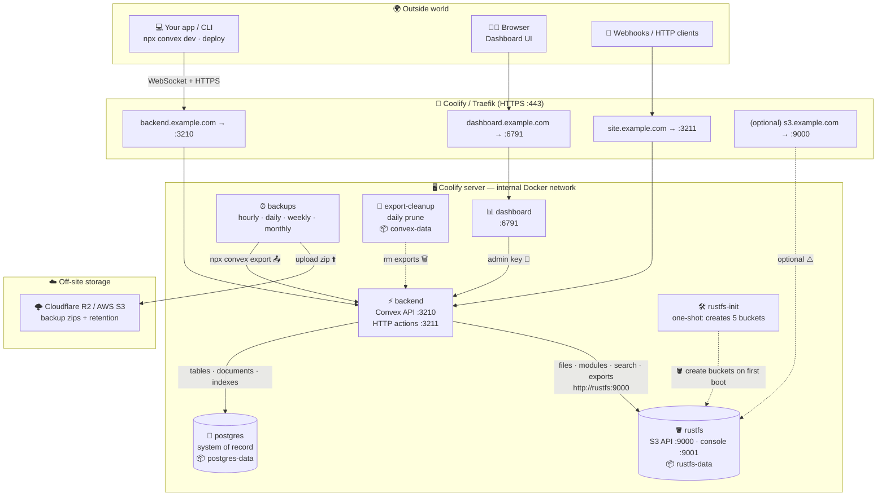

# Convex Self-Hosted on Coolify — Postgres + RustFS + Off-site Backups

A single `docker-compose.yaml` that deploys a production-grade, fully self-hosted [Convex](https://github.com/get-convex/convex-backend) stack on [Coolify](https://coolify.io):

| Service          | Role                                                                                  |
| ---------------- | ------------------------------------------------------------------------------------- |
| `backend`        | Convex backend (API on `:3210`, HTTP actions on `:3211`)                              |
| `dashboard`      | Convex dashboard (`:6791`)                                                            |
| `postgres`       | PostgreSQL 17 — replaces the default embedded SQLite as the system of record          |
| `rustfs`         | [RustFS](https://rustfs.com) — S3-compatible object storage for Convex file storage, exports, modules and search indexes |
| `rustfs-init`    | One-shot job that creates the 5 buckets Convex needs                                  |
| `backups`        | [convex-self-hosted-backups](https://github.com/orenaksakal/convex-self-hosted-backups) — scheduled exports to **external** AWS S3 or Cloudflare R2 |
| `export-cleanup` | Daily prune of leftover export zips in the Convex data volume                         |

## Architecture



Solid arrows = runtime traffic · dashed = one-shot or maintenance jobs. Everything inside the server box talks over the private Docker network; only the Traefik domains are public.


**Why external backups?** RustFS lives on the same server as Convex. If the server dies, so does your "backup". The `backups` service ships full `npx convex export` snapshots (database + file storage) off-site to AWS S3 or Cloudflare R2 on hourly / daily / weekly / monthly schedules with automatic retention pruning.

---

## 1. Deploy on Coolify

### 1.1 Create the resource

1. In Coolify: **+ New Resource → Docker Compose** (empty), paste the contents of `docker-compose.yaml` (or point Coolify at a Git repo containing it).
2. Coolify parses the file and auto-generates the *magic variables*:
   - `SERVICE_USER_POSTGRES` / `SERVICE_PASSWORD_POSTGRES`
   - `SERVICE_USER_RUSTFS` / `SERVICE_PASSWORD_RUSTFS`
   - `SERVICE_HEX_64_SECRET` (the Convex instance secret)
   - `SERVICE_URL_*` FQDNs for each exposed port

### 1.2 Assign domains

Three separate HTTPS domains are **required** — Convex clients refuse plain HTTP, and the API (`3210`) and HTTP actions (`3211`) must be reachable on distinct hostnames:

| Variable                     | Example domain                     | Container port | Notes                              |
| ---------------------------- | ----------------------------------- | -------------- | ---------------------------------- |
| `SERVICE_URL_BACKEND_3210`   | `https://backend.example.com`  | `3210`         | Convex API (`CONVEX_CLOUD_ORIGIN`) |
| `SERVICE_URL_SITE_3211`      | `https://site.example.com`     | `3211`         | HTTP actions (`CONVEX_SITE_ORIGIN`)|
| `SERVICE_URL_DASHBOARD_6791` | `https://dashboard.example.com`| `6791`         | Dashboard                          |
| `SERVICE_URL_RUSTFS_9000`    | `https://s3.example.com`       | `9000`         | *Optional* — RustFS S3 API         |
| `SERVICE_URL_CONSOLE_9001`   | `https://s3-console.example.com`| `9001`        | *Optional* — RustFS admin console  |

⚠️ **Pitfall: Coolify often only generates domains for `backend:3210` and `dashboard:6791`, silently skipping the `3211` site domain.** Since ports `3210` and `3211` both live on the **same `backend` container**, you must attach **two domains to the Backend service**, each with an explicit port mapping. In Coolify → your resource → **Backend** service → **Domains** field, enter both, comma-separated:

```
https://backend.example.com:3210,https://site.example.com:3211
```

(The `:3210` / `:3211` suffix tells Coolify's Traefik which container port to route each domain to — the public URLs remain standard `443` HTTPS.)

After saving, verify that the container env got populated correctly and **redeploy**:

- `CONVEX_CLOUD_ORIGIN` → the `3210` domain
- `CONVEX_SITE_ORIGIN` → the `3211` domain

If Coolify didn't populate `SERVICE_URL_SITE`, set `CONVEX_SITE_ORIGIN` manually in the environment variables. You can check what the running backend actually sees with:

```bash
docker compose exec backend env | grep -E 'CONVEX_(CLOUD|SITE)_ORIGIN'
```

> **No trailing slashes anywhere.** `https://backend.example.com` — not `https://backend.example.com/`. The Convex CLI concatenates paths onto these URLs, and a trailing slash causes silent `Retrying request...` loops in `npx convex dev` / `deploy`.

#### RustFS domains — should you expose them?

Convex talks to RustFS over the internal Docker network at `http://rustfs:9000`, so **the stack works fully without any public RustFS domain**. Exposing them is a deliberate choice. If you do, attach them on the RustFS service the same way as the backend (comma-separated with port mappings):

```
https://s3.example.com:9000,https://s3-console.example.com:9001
```

**Port 9000 — S3 API** (`SERVICE_URL_RUSTFS_9000`, e.g. `https://s3.example.com`)

| Pros | Cons |
| ---- | ---- |
| Browse/manage buckets remotely with any S3 client (`aws cli`, Cyberduck, rclone) without SSH-ing into the server | Larger attack surface: anyone can probe the endpoint; security rests entirely on your access/secret keys |
| Reuse RustFS as general-purpose object storage for *other* apps and servers | Public presigned URLs would leak your infra hostname and bypass Convex's access control if misused |
| Off-server tooling (e.g. rclone sync of the RustFS volume from another machine) becomes trivial | Convex still uses the internal endpoint — a public 9000 domain adds **zero** benefit to Convex itself |
|  | RustFS is a young project; keeping it off the public internet limits blast radius of any future CVE |

**Port 9001 — Admin console** (`SERVICE_URL_CONSOLE_9001`, e.g. `https://s3-console.example.com`)

| Pros | Cons |
| ---- | ---- |
| Web UI to inspect buckets, objects and access keys — handy for debugging what Convex actually wrote | It's an admin panel: a credential leak or console vulnerability = full control of all Convex file data |
| No CLI/SSH needed for quick checks | Login is just the same access/secret key pair — no 2FA, no SSO, no rate limiting beyond what Traefik gives you |

**Recommendation:** keep both internal (assign no domains). When you need the console occasionally, tunnel instead of exposing it:

```bash
# From your machine — console then available at http://localhost:9001
ssh -L 9001:localhost:9001 user@your-server
docker compose exec rustfs true  # or map the port temporarily
```

Or use `ssh -L 9000:...` with the `aws` CLI pointed at `http://localhost:9000` for S3 access. If you must expose them permanently, at minimum: strong generated keys (Coolify's defaults are fine), Traefik IP allow-list or basic-auth middleware on the console domain, and Crowdsec/fail2ban on the host.

### 1.3 Set the environment variables

In **Environment Variables**, add the backup-target credentials (see section 3 for how to obtain them):

```env
# Admin key — leave empty on FIRST deploy, fill in after step 1.5
CONVEX_SELF_HOSTED_ADMIN_KEY=

# External backup target (AWS S3 or Cloudflare R2)
BACKUP_AWS_ACCESS_KEY_ID=xxxxxxxx
BACKUP_AWS_SECRET_ACCESS_KEY=xxxxxxxx
BACKUP_S3_BUCKET=my-convex-backups
BACKUP_S3_REGION=auto              # 'auto' for R2, e.g. 'eu-west-1' for AWS
BACKUP_S3_ENDPOINT=                # empty for AWS S3; R2 endpoint for Cloudflare

# Optional
INCLUDE_FILE_STORAGE=true
SHOUTRRR_URL=                      # e.g. telegram://<token>@telegram?chats=<chatid>
```

Everything else has sensible defaults baked into the compose file.

### 1.4 First deploy

Hit **Deploy**. Startup order is enforced via healthchecks:

```
postgres ──┐
           ├─► rustfs ─► rustfs-init (creates buckets) ─► backend ─► dashboard
rustfs ────┘                                                      └─► backups
```

The `backups` container is **built from source** (the repo publishes no image), so the first deploy takes an extra minute or two.

### 1.5 Generate the admin key

Once `backend` is healthy, exec into it (Coolify → resource → Terminal on the `backend` container, or via SSH):

```bash
docker compose exec backend ./generate_admin_key.sh
```

Copy the printed key (format: `self-hosted-convex|01...`) and:

1. Paste it into the `CONVEX_SELF_HOSTED_ADMIN_KEY` environment variable in Coolify.
2. Redeploy (only the `backups` container actually needs the restart).
3. Use the same key to log into the dashboard at your `SERVICE_URL_DASHBOARD_6791` domain.

### 1.6 Point your app at it

In your frontend/CLI project's `.env` (Vite example):

```env
# Client bundle — the Convex API (3210 domain)
VITE_CONVEX_URL=https://backend.example.com

# Server-only — used by the CLI for `convex dev` / `convex deploy`
CONVEX_SELF_HOSTED_URL=https://backend.example.com
CONVEX_SELF_HOSTED_ADMIN_KEY=self-hosted-convex|01...

# HTTP actions / webhooks — the 3211 SITE domain (NOT the dashboard!)
CONVEX_SITE_URL=https://site.example.com
```

```bash
npx convex dev        # develop against your self-hosted backend
npx convex deploy     # push functions
```

Common mistakes that all end in `Retrying request (attempt N/6)...` loops:

- **Trailing slash** on any of these URLs — remove it.
- **`CONVEX_SITE_URL` set to the dashboard domain** — the dashboard (`6791`) is just the admin UI; HTTP actions live on the `3211` site domain from step 1.2.
- **Mismatch between the URL you call and `CONVEX_CLOUD_ORIGIN` inside the container** — scheme, host, no port, no trailing slash must match exactly.

Quick sanity check — this must return a version string before the CLI will work:

```bash
curl -i https://backend.example.com/version
```

---

## 2. How the pieces fit together

### Postgres (system of record)

`POSTGRES_URL` is set **without a database name** — Convex derives the DB name from `INSTANCE_NAME` (dashes → underscores, so `self-hosted-convex` → `self_hosted_convex`), which the `postgres` service pre-creates via `POSTGRES_DB`. `DO_NOT_REQUIRE_SSL=true` is safe because traffic never leaves the internal Docker network.

> If you change `INSTANCE_NAME`, change `CONVEX_DB_NAME` to match (underscored version) **before first deploy**.

### RustFS (S3 storage)

The `rustfs-init` one-shot job creates the five buckets Convex expects:

- `convex-snapshot-exports`
- `convex-snapshot-imports`
- `convex-modules`
- `convex-user-files`
- `convex-search-indexes`

The backend uses path-style addressing (`AWS_S3_FORCE_PATH_STYLE=true`), disabled SSE and checksums (required for most S3-compatible stores), and the internal endpoint `http://rustfs:9000`. User file uploads, deployed modules, search indexes and export/import snapshots all land in RustFS instead of the container filesystem.

### Data volumes

| Volume          | Contents                                    |
| --------------- | ------------------------------------------- |
| `postgres-data` | All Convex tables/documents/indexes         |
| `rustfs-data`   | Files, modules, search indexes, exports     |
| `convex-data`   | Backend scratch/state (incl. staged exports)|

---

## 3. Off-site backups (AWS S3 or Cloudflare R2)

The `backups` service runs [orenaksakal/convex-self-hosted-backups](https://github.com/orenaksakal/convex-self-hosted-backups). It calls `npx convex export` against the backend (including file storage when `INCLUDE_FILE_STORAGE=true`), uploads the zip to your external bucket, and prunes old backups per frequency:

| Frequency | Default retention (`MAX_*_BACKUPS`) |
| --------- | ----------------------------------- |
| Hourly    | 24                                  |
| Daily     | 7                                   |
| Weekly    | 4 (Sundays)                         |
| Monthly   | 12 (1st of month)                   |

Schedules use randomized minutes/early-morning hours to avoid collisions. `RUN_ON_STARTUP=true` triggers an immediate backup on boot so you can verify the pipeline right away.

### Option A — Cloudflare R2 (recommended: zero egress fees)

1. Cloudflare Dashboard → **R2 Object Storage** → **Create bucket** (e.g. `my-convex-backups`).
2. **R2 → Manage API Tokens → Create API Token**:
   - Permissions: **Object Read & Write**
   - Scope: only your backup bucket
3. Note the **Access Key ID**, **Secret Access Key**, and your **Account ID**.
4. Set in Coolify:

```env
BACKUP_AWS_ACCESS_KEY_ID=<r2-access-key-id>
BACKUP_AWS_SECRET_ACCESS_KEY=<r2-secret-access-key>
BACKUP_S3_BUCKET=my-convex-backups
BACKUP_S3_REGION=auto
BACKUP_S3_ENDPOINT=https://<ACCOUNT_ID>.r2.cloudflarestorage.com
```

### Option B — AWS S3

1. Create a bucket (e.g. `my-convex-backups`) in your preferred region. Enable versioning if you want extra safety.
2. Create an IAM user with programmatic access and a policy scoped to that bucket:

```json
{
  "Version": "2012-10-17",
  "Statement": [
    {
      "Effect": "Allow",
      "Action": ["s3:PutObject", "s3:GetObject", "s3:DeleteObject", "s3:ListBucket"],
      "Resource": [
        "arn:aws:s3:::my-convex-backups",
        "arn:aws:s3:::my-convex-backups/*"
      ]
    }
  ]
}
```

3. Set in Coolify:

```env
BACKUP_AWS_ACCESS_KEY_ID=<iam-access-key-id>
BACKUP_AWS_SECRET_ACCESS_KEY=<iam-secret-access-key>
BACKUP_S3_BUCKET=my-convex-backups
BACKUP_S3_REGION=eu-west-1
BACKUP_S3_ENDPOINT=
```

### Resulting bucket layout

```
my-convex-backups/
  hourly/   backup-2026-07-23T05-00-00-000Z.zip
  daily/    backup-2026-07-23T03-14-00-000Z.zip
  weekly/   backup-2026-07-19T02-41-00-000Z.zip
  monthly/  backup-2026-07-01T04-02-00-000Z.zip
```

### Failure notifications (optional)

Set `SHOUTRRR_URL` to get pinged when a backup fails. Telegram example:

```env
SHOUTRRR_URL=telegram://<bot-token>@telegram?chats=<chat-id>
```

Shoutrrr also supports Discord, Slack, email, etc.

### Export cleanup

Every `convex export` leaves a zip in `/convex/data/storage/exports` inside the backend container. The `export-cleanup` sidecar wipes that directory daily so the `convex-data` volume doesn't balloon.

---

## 4. Restoring from a backup

Backups are standard Convex export zips, importable into **any** Convex instance (self-hosted or cloud):

```bash
# Download the snapshot from S3/R2, then:
export CONVEX_SELF_HOSTED_URL=https://backend.example.com
export CONVEX_SELF_HOSTED_ADMIN_KEY='self-hosted-convex|01...'

npx convex import --replace-all backup-2026-07-23T03-14-00-000Z.zip
```

`--replace-all` wipes the target instance and restores tables + file storage from the snapshot. Drop the flag to merge instead. Test a restore into a scratch instance at least once — a backup you've never restored is a hope, not a backup.

---

## 5. Operations cheat-sheet

```bash
# Trigger a manual backup right now (restart the backups container with RUN_ON_STARTUP=true)
docker compose restart backups

# Tail backup logs
docker compose logs -f backups

# Generate/regenerate the admin key
docker compose exec backend ./generate_admin_key.sh

# Check Convex backend health
curl https://backend.example.com/version
```

### Upgrading Convex

The compose pins backend + dashboard to a specific commit hash (Coolify's tested revision). To upgrade, change both image tags to the **same** newer revision and redeploy. Convex only supports rolling forward — take a backup first, and never downgrade an instance whose data has been migrated.

### Gotchas

- **Missing 3211 domain:** Coolify's auto-generated domains often cover only `3210` and `6791`. Add the site domain with an explicit `:3211` port mapping on the Backend service (step 1.2), or HTTP actions and webhooks won't work.
- **Admin key chicken-and-egg:** the `backups` container will crash-loop until `CONVEX_SELF_HOSTED_ADMIN_KEY` is set (step 1.5). That's expected on first deploy.
- **Backups ≠ RustFS:** the backup service intentionally uses separate `BACKUP_*` credentials. Never point it at the local RustFS — that defeats the purpose.
- **`INSTANCE_SECRET` is sacred:** losing `SERVICE_HEX_64_SECRET` or the Postgres volume without a backup means losing the deployment. The off-site snapshots are your recovery path.
- **HTTPS required:** Convex clients require the backend/site/dashboard domains to be served over TLS; Coolify's Traefik handles the certificates automatically once domains are assigned.